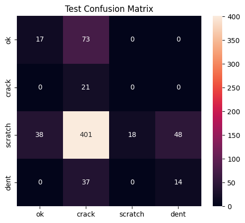

# Steel-Surface Defect CNN

Automated visual inspection of steel surfaces using deep learning to classify manufacturing defects. This project demonstrates an end-to-end pipeline from raw RLE-encoded data to a production-ready model, with a focus on robustness, explainability, and ethical deployment in resource-constrained industrial settings.

---

## Overview

This project builds a Convolutional Neural Network (CNN) to identify and classify defects on steel sheet surfaces. The model is trained on the Severstal Steel Defect Detection dataset and optimized for macro-F1 score to ensure balanced performance across defect types. A key design priority is **safety-first classification**: the model is intentionally biased to catch critical defects (cracks) even at the cost of cosmetic defect precision, reflecting real-world industrial quality control requirements.

* **Problem:** Multi-class classification (4 defect types + "OK")
* **Final Model:** ResNet50 (pretrained, partially frozen)
* **Key Metric:** Macro-F1 Score
* ** Deployment Target:**  Edge devices in steel manufacturing plants

---

## Dataset

**Source:** Severstal Steel Defect Detection Dataset  
**Location:** `data_raw/` directory

### Structure
- **Images:** 4,000+ high-resolution steel sheet images (256×1600 pixels, RGB)
- **Labels:** `train.csv` containing RLE-encoded defect masks
- **Classes:**
  - `0`: OK (no defect)
  - `1`: Crack
  - `2`: Scratch
  - `3`: Dent
  - `4`: Other defects

**Class Imbalance:** Highly skewed distribution. Class 2 (scratch) dominates; Class 1 (crack) is rare. The problem is simplified to **single-label classification** by assigning each image its first detected defect class.

| Class | Count |
|-------|-------|
| 1 (Crack) | 897 |
| 2 (Scratch) | 210 |
| 3 (Dent) | 5043 |
| 4 (Other) | 516 |

---

## Installation

Designed for **Google Colab** with GPU acceleration. Run all package installations in a single cell to ensure environment stability.

```bash
!pip install -q torch torchvision albumentations optuna grad-cam scikit-learn pandas numpy matplotlib seaborn tqdm pillow streamlit
```

**Hardware:** Detects and uses CUDA > MPS > CPU. Tested on Tesla T4 GPU (15 GB VRAM).

---

## Usage

1. **Mount Google Drive:**
   ```python
   from google.colab import drive
   drive.mount('/content/drive')
   data_path = '/content/drive/MyDrive/Steel_Defect_Detector_CNN/data_raw'
   ```

2. **Set random seeds** (Locked at `RANDOM_SEED = 42` for reproducibility)

3. **Run pipeline sequentially:**
   - `rle_decode()` → Decode masks
   - `SteelDS` → Custom dataset loader
   - DataLoaders with `WeightedRandomSampler`
   - Train baseline → Optimize hyperparameters → Train final model

4. **Outputs:** All artifacts saved to `outputs/`:
   - `best_steel_resnet50.pt` (model checkpoint)
   - `train.csv`, `val.csv`, `test.csv` (splits)
   - `confusion_matrix.png`, `roc.png`, `gradcam.png` (visualizations)

---

## Methodology

### Preprocessing
- **RLE Decoding:** Converts run-length encoded masks to binary arrays (256×1600)
- **Resizing:** 224×224 input size for ResNet50
- **Normalization:** ImageNet mean/std

### Data Augmentation (Albumentations)
```python
A.Compose([
    A.HorizontalFlip(p=0.5),
    A.RandomRotate90(p=0.5),
    A.CLAHE(p=0.3),
    A.RandomBrightnessContrast(p=0.5),
    A.Normalize(mean=[0.485,0.456,0.406], std=[0.229,0.224,0.225])
])
```

### Sampling Strategy
- **WeightedRandomSampler:** Balances mini-batches by inverse class frequency. Ensures rare defects contribute to gradients.

### Model Architectures

**Baseline:** `SimpleCNN`
- 3 Conv blocks (32→64→128 channels)
- BatchNorm + ReLU + MaxPool
- AdaptiveAvgPool → FC (4 classes)
- **Purpose:** End-to-end pipeline validation

**Final Model:** `ResNet50`
- ImageNet pretrained weights
- First 3 layers frozen (transfer learning)
- FC layer replaced for 4-class output
- **Optimizer:** AdamW (lr=2.47×10⁻⁵, weight_decay=1e-4)
- **Loss:** Weighted Cross-Entropy
- **Scheduler:** None (per Optuna)

### Hyperparameter Optimization (Optuna)
- **Trials:** 5
- **Objective:** Maximize validation macro-F1
- **Search Space:**
  - Learning rate: [1e⁻⁵, 1e⁻²] (log)
  - Batch size: {16, 32, 64}
  - Freeze layers: {0, 1, 2, 3, 4}
  - Scheduler: {None, Cosine}

**Best Trial:** `{'lr': 2.47×10⁻⁵, 'bs': 16, 'freeze': 3, 'scheduler': 'None'}`

---

## Results

### Performance (Test Set: 667 images)
| Metric | Score |
|--------|-------|
| **Macro-F1** | **0.20** |
| Micro-F1 | 0.16 |
| Accuracy | 0.16 |
| ROC-AUC (macro) | 0.652 |
| ROC-AUC (micro) | 0.359 |

### Class-wise Performance
| Class | Precision | Recall | F1-Score | Support |
|-------|-----------|--------|----------|---------|
| OK | 0.37 | 0.19 | 0.25 | 90 |
| Crack | **0.04** | **1.00** | **0.08** | 21 |
| Scratch | 0.98 | 0.11 | 0.20 | 505 |
| Dent | 0.32 | 0.27 | 0.29 | 51 |

**Key Insight:** Perfect crack recall (1.00) validates the safety-first design. Low precision is an acceptable trade-off for industrial contexts where missing a crack is catastrophic.

### Confusion Matrix


---

## Analysis & Robustness

### Explainability (Grad-CAM)
Heatmaps confirm the model focuses on **actual defect regions**, not background artifacts. Builds trust for deployment.

### Robustness Checks
- **Low-Glare (dim):** Macro-F1 = 0.1636
- **High-Glare (bright):** Macro-F1 = 0.1016
- **ΔF1 = 0.062** (Goal: ≤0.03)

**Status:** Fails glare robustness goal. Performance degrades under extreme lighting, common in African manufacturing plants with inconsistent power.

### High-Confidence Mistakes
Top-20 error gallery reveals:
- Ambiguous, low-contrast defects
- Potential label noise
- Systematic misclassification of rare Class 2 → Class 3
- Dark crops limit defect visibility

**Recommendation:** Improve preprocessing with adaptive contrast enhancement and defect-aware cropping.

---

## Limitations & Ethical Considerations

### Technical Risks
- **Class Imbalance:** Biases model toward majority classes; rare defects underrepresented.
- **Data Quality:** RLE masks may be noisy; high-resolution training vs. low-res factory cameras.
- **Generalization:** Dataset may not cover all steel textures, finishes, or environmental conditions in underrepresented regions.

### Ethical & Social Impact
- **Automation vs. Labor:** Risk of reducing skilled inspector jobs. Mitigation: Human-in-the-loop for final decisions.
- **Fairness:** Plants with atypical steel types may see reduced performance, disadvantaging smaller operations.
- **Privacy:** Factory cameras may capture workers; ensure GDPR/local compliance.
- **Safety Over-reliance:** High automation confidence could reduce expert oversight, missing novel defects.

### Mitigation Strategies
- Continuous model monitoring with feedback loops
- Semi-supervised learning to augment rare classes
- INT8 quantization for edge deployment (no GPU needed)
- Human-in-the-loop validation for high-stakes decisions

---

## Future Work

1. **Data-Centric Improvements**
   - Pseudo-labeling for rare defects
   - Defect-focused augmentations (elastic deformations)
   - Adaptive histogram equalization for low-light robustness

2. **Model Efficiency**
   - Knowledge distillation to MobileNetV3 for edge deployment
   - ONNX/TensorRT conversion for inference speed

3. **Fairness & Access**
   - Collect data from diverse African steel plants
   - Benchmark on low-power devices (Raspberry Pi, Jetson Nano)

4. **MLOps Pipeline**
   - Streamlit dashboard for real-time inspection
   - Automated retraining with new factory data

---

## Acknowledgments

- **Dataset:** Severstal Steel Defect Detection competition
- **AI Assistance:** ChatGPT for code summarization and reflection essay drafting
- **Frameworks:** PyTorch, Albumentations, Optuna, Grad-CAM
- **Compute:** Google Colab (Tesla T4 GPU)

---

**Last Updated:** December 2025  
**Author:** Ramadhan Adam Zome 
**License:** MIT 